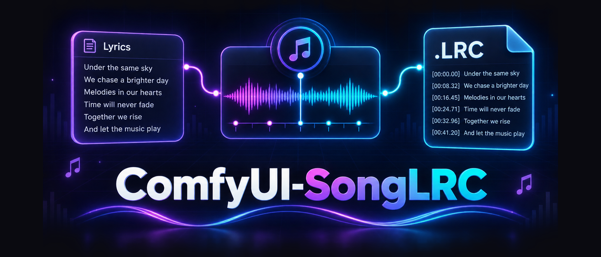
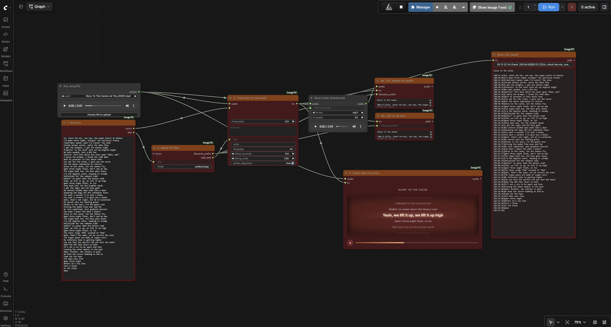
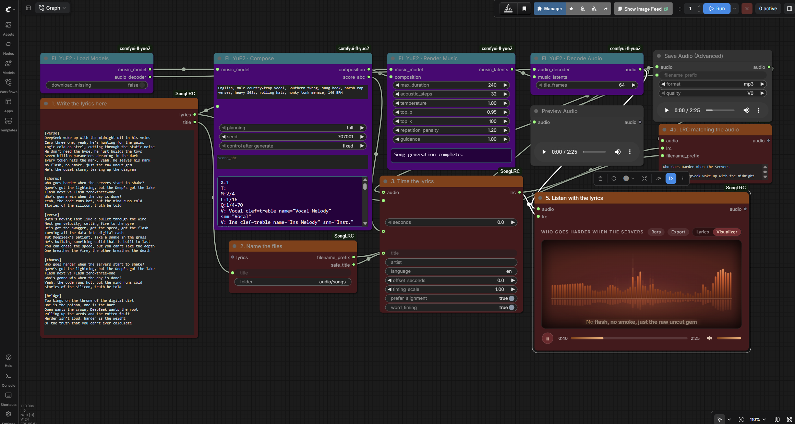
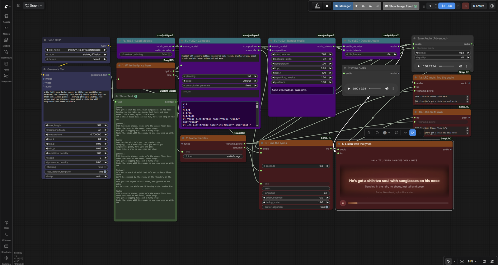
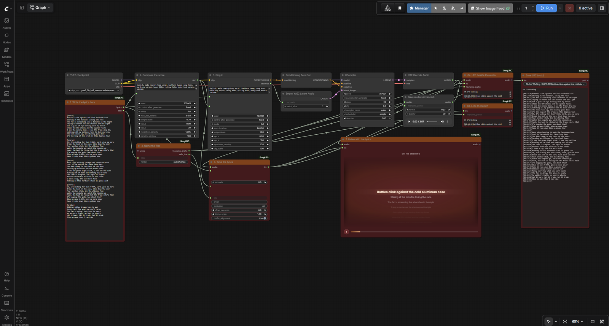

# ComfyUI-SongLRC



Turn generated song lyrics into a timed `.lrc` file that is saved beside the audio,
with a matching name and counter.

```
output/audio/songs/Hold The Line Tonight_00007.mp3
output/audio/songs/Hold The Line Tonight_00007.lrc
```

Built and tested against [ComfyUI-FL-YuE2](https://github.com/filliptm/ComfyUI-FL-YuE2).
It also works with MiniMax Music 3 and, in principle, any node chain that produces
lyrics plus an `AUDIO` output.

This pack was previously called **ComfyUI-MiniMaxLRC**. See Migrating below.

## What it gives you

- Real per-line timestamps from forced alignment when WhisperX is installed
- Score-aware timing from a YuE2 ABC score when it is not
- A song title taken from a `Title:` line, or derived from the repeated hook
- Audio and LRC written with the identical name and five digit counter
- A standalone LRC saver too, so the pack needs no other node packs
- Word-by-word karaoke timing (enhanced LRC) from the same alignment
- A player that scrolls the lyrics against the audio, so timing is checked by ear,
  and exports a lyric video in one click
- ComfyUI's own Save Audio (Advanced) keeps working, so FLAC, MP3 and Opus
  quality controls are untouched

## Install

Through ComfyUI-Manager, search for `ComfyUI-SongLRC`.

Or clone it:

```bash
cd ComfyUI/custom_nodes
git clone https://github.com/TheAwaken1/ComfyUI-SongLRC
pip install -r ComfyUI-SongLRC/requirements.txt
```

Restart ComfyUI.

## The nodes

| Node | Purpose |
|------|---------|
| Lyrics Clean | Strips titles, markdown and stray tags. Outputs clean lyrics and a title. |
| Song Filename | Turns a title into `<folder>/<title>` for Save Audio (Advanced). |
| Lyrics to LRC | Times the lyrics against the audio and writes the LRC text. |
| Save Matching LRC | Writes the LRC next to the audio file that was just saved. |
| Save LRC (auto) | Writes the LRC on its own, with its own counter. |
| Music Player (SongLRC) | Plays the song with its lyrics highlighted in time. |

Both savers show the finished lyrics on the node after a run: the song title, then
the timed lines. The length and byline tags stay in the file, where players read
them, rather than cluttering the node. The saved path goes to the console.

### The player

Connect the final `AUDIO` and the LRC to **Music Player (SongLRC)** and run the
graph.

Lyrics ride a wheel rather than sitting in a list. The current line holds the centre,
larger and lit; the lines before and after tilt away on an arc and fade toward the
edges of the frame, which is masked top and bottom so nothing ends abruptly. Click
any line to jump to it. A blank cue is an instrumental gap and shows as three dots
rather than leaving a lyric stuck on screen.

Transport is a play button, the elapsed and total time either side of the progress
bar, and a volume control. Drag the bar to scrub. Click the speaker to mute, drag
the small bar to set the level, or scroll over it to nudge it.

Two tabs sit above the frame. **Lyrics** is the wheel. **Visualizer** swaps it for
one of four styles, with the current line kept as a caption underneath. Click the
style button beside the tabs to switch:

| Style | What it does |
|-------|--------------|
| Ring | A spectrum ring around a core that swells on the kick, a waveform traced inside the core, and sparks thrown off on hard beats. |
| Bars | The classic spectrum: 72 bars with a reflection under the baseline and a floor glow that flares on the kick. |
| Tunnel | Hexagons warped by the spectrum drift out of a moving vanishing point; every kick fires a bright ring, surges the speed and jolts the camera. |
| Warp | A starfield that cruises between beats and punches into hyperspace on every kick, each star flickering with its own band of the mix. |

Every style listens the same way: each band is measured against its own recent
level, so hits jump out even in a loud, compressed master, and a kick detector
watches the lowest bands for sharp rises.

The node remembers the tab, style and volume when the workflow is saved.

When the LRC was timed by WhisperX, the current line fills word by word as it is
sung, karaoke style, in the wheel and in the Visualizer caption alike. Lyrics to LRC
writes those word times as enhanced LRC, a `<mm:ss.xx>` tag before each word:

```
[00:12.40]<00:12.40>Hold <00:12.86>the <00:13.10>line<00:14.02>
```

Players that understand enhanced LRC get the karaoke fill too. For one that shows
the tags as text, turn off `word_timing`. Lines timed without WhisperX stay plain
and light up whole.

**Export** renders a 720p lyric video in the selected style: the visualizer (Tunnel
and Warp fill the whole frame), the song title, the current line with its karaoke
fill and the next line under it, a progress bar with a playhead, and the elapsed and
total time. It renders offline, faster than real time (a three minute song takes
seconds, not three minutes), and never touches playback, so the song can keep
playing. The button shows Rendering, Uploading and Encoding in turn; clicking it
while it renders cancels.

The browser draws each frame and compresses it with WebCodecs. ComfyUI then adds
the song's own audio and writes an H.264 + AAC MP4 to
`output/video/SongLRC/<title>_00001.mp4`, which downloads when it is done.

Browsers without WebCodecs fall back to recording in real time: the song plays
once from the top, and clicking Export again stops early and keeps what was
recorded.

It is also the fastest way to judge timing, because a drift of half a second is
obvious by ear and invisible in a text file. If lines run consistently early or late,
adjust `timing_scale` on Lyrics to LRC, or shift everything with `offset_seconds`.

The two savers do different jobs, and you normally want one of them, not both.
**Save Matching LRC** waits for Save Audio (Advanced) and reuses that file's exact
name and number, so the pair always match. That is the one to use whenever you are
saving the song. **Save LRC (auto)** waits for nothing, which is what you want when
you are only after the lyrics, or when the audio is saved somewhere else. Running
both writes the same lyrics twice under different names.

Every node in the pack shares one colour, a burnt-orange title over a deep crimson
body, so a SongLRC chain is recognisable at a glance among other node packs.

## Using it



Two examples ship with the pack.

**`example_workflows/any_audio_to_lrc.json`** uses only this pack plus ComfyUI's own
audio nodes. Point it at any song file, paste that song's lyrics, and it times them,
saves the LRC and plays it back. Pasting a finished `.lrc` works too: Lyrics Clean
strips the old timestamps and header tags first, and takes the title from the file,
so nothing gets timed twice. Nothing else needs to be installed, which makes it
the quickest way to see how the six nodes connect.



**`example_workflows/yue2_song_to_lrc.json`** is the full pipeline using
[ComfyUI-FL-YuE2](https://github.com/filliptm/ComfyUI-FL-YuE2).



**`example_workflows/yue2_song_to_lrc_qwen3.json`** adds a local Qwen3-VL model that
writes the lyrics, so a song idea becomes a finished track with timed lyrics in one
run. The generated text goes into Lyrics Clean, which feeds both the song model and
the timing, so the sung words and the timed words cannot drift apart.



**`example_workflows/comfy_yue2_song_to_lrc.json`** is the same pipeline on ComfyUI's
own YuE2 nodes, so it needs no song node pack at all. The generated ABC score feeds
the LRC timing here too, so sections land where the music puts them. It is a straight line from lyrics to
a finished song with a matching LRC, using only this pack, FL-YuE2 and ComfyUI's own
audio nodes.

Note that FL-YuE2 names the render length `max_duration`, which is what the example
uses. If you run a fork that renamed it, set the length on the Render node once after
loading.

**You do not need a text generator.** Type or paste your lyrics into Lyrics Clean.
Its lyrics output feeds both the Compose node and Lyrics to LRC, so the words that
get sung and the words that get timed can never drift apart. Its title output feeds
Song Filename.

If you do use a generator, such as a Qwen or Spark Studio node, connect it to the
Lyrics Clean text input instead of typing. Everything downstream is identical.

Leave the title field on Song Filename blank and it derives one from the repeated
chorus line. Fill it in to name the song yourself.

### Timing quality

Three methods, best first. The node picks the best one available automatically.

1. **Forced alignment.** Connect the final `AUDIO` to Lyrics to LRC and install
   WhisperX. This gives real timestamps.
2. **Score timing.** Connect the Compose node's `score_abc` output to the
   `structure` input. Sections are placed using the score's tempo and bar counts
   rather than being spread evenly. The example workflow wires this for you.
3. **Even timing.** The fallback. Lyrics are spread across the song with an
   allowance for the intro and outro.

If timings drift, adjust `timing_scale` above 1 when lyrics run early and below 1
when they run late. Use `offset_seconds` to shift everything.

### Installing WhisperX safely

A plain `pip install whisperx` often replaces your CUDA PyTorch with a CPU-only
build and breaks ComfyUI. Install it without touching torch:

```bash
pip install whisperx --no-deps
pip install faster-whisper ctranslate2 nltk pandas pyannote.audio omegaconf
```

Then confirm CUDA still works:

```bash
python -c "import torch; print(torch.cuda.is_available())"
```

If that prints `False`, reinstall the CUDA torch build you had before. Skipping
WhisperX is fine; the nodes fall back to score or even timing.

## Migrating from ComfyUI-MiniMaxLRC

Old workflows keep loading. The four previous class names are registered as hidden
aliases pointing at the renamed nodes, so nothing turns into a red missing node.

Two changes to know about:

- The default output folder is now `audio/songs` rather than `audio/YuE2`. Song
  Filename has a `folder` widget, so set it back if you want the old path.
- The LRC `ar:` tag is now blank by default and is left out when empty, instead of
  claiming every song was made by MiniMax Music 3.

Remove the old `ComfyUI-MiniMaxLRC` folder after installing this one, or the two
packs will fight over the same class names.

## Running it from code

The nodes run inside ComfyUI, so drive them through ComfyUI's API. Export your
graph with **Workflow, Export (API)** first, then post it.

```bash
curl -X POST http://127.0.0.1:8188/prompt -H "Content-Type: application/json" -d @workflow_api.json
```

```python
import json, urllib.request

graph = json.load(open("workflow_api.json", encoding="utf-8"))
# Node 8 is Lyrics Clean in the bundled example.
graph["8"]["inputs"]["text"] = "[verse]\nNew words here\n[chorus]\nAnd a hook"
body = json.dumps({"prompt": graph}).encode()
req = urllib.request.Request("http://127.0.0.1:8188/prompt", data=body,
                             headers={"Content-Type": "application/json"})
print(json.load(urllib.request.urlopen(req))["prompt_id"])
```

```javascript
const graph = await (await fetch("./workflow_api.json")).json();
graph["8"].inputs.text = "[verse]\nNew words here\n[chorus]\nAnd a hook";
const r = await fetch("http://127.0.0.1:8188/prompt", {
  method: "POST",
  headers: { "Content-Type": "application/json" },
  body: JSON.stringify({ prompt: graph }),
});
console.log((await r.json()).prompt_id);
```

Poll `GET /history/<prompt_id>` for completion. The LRC lands in your output folder
next to the audio; Save Matching LRC also reports the path it wrote.

## Tests

```bash
python -m unittest discover -s tests
```

## License

MIT
